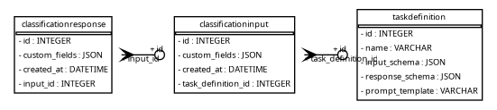

# JSON Schema-Based Extensible Data Model


## Executive Summary

This document describes a flexible approach for supporting user-defined
data fields in classification workflows using PostgreSQL. The system
uses static tables with a JSONB column for custom fields, stores field
definitions (schemas) in the database, and validates data in the
application before saving. This enables dynamic, workflow-driven
extensibility without changing the database schema for each new use
case.

------------------------------------------------------------------------

## TL;DR

- Static tables + JSONB for custom fields
- Schemas stored in DB
- Validation in Python
- Flexible, workflow-driven

------------------------------------------------------------------------

## How it Works (At a Glance)

    [User defines schema & prompt]
            |
            v
    [Schema stored in task_definition table]
            |
            v
    [Incoming data]
            |
            v
    [Validate data against schema (Python/jsonschema)]
            |
            v
    [Store valid data in classification_input (custom_fields JSONB)]

------------------------------------------------------------------------

## Quick Reference Table

| Concept | Implementation in DB | Example Column/Table |
|----|----|----|
| Workflow definition | task_definition | name, input_schema, response_schema |
| User data (input) | classification_input | custom_fields (JSONB) |
| User data (response) | classification_response | custom_fields (JSONB) |
| Schema validation | Application (Python) | jsonschema library |

------------------------------------------------------------------------

## Main Flow

- User defines workflow (fields, prompt)
- Store schemas and prompt in `task_definition`
- User submits data for a workflow
- Application fetches schema from DB
- Validate data with `jsonschema`
- If valid, store in `classification_input.custom_fields`
- LLM/processing as needed
- Store response in `classification_response.custom_fields`
- Query/report using Postgres JSONB features

------------------------------------------------------------------------

## Real-World Examples

### Example 1: Sentiment Classification

- **task_definition.input_schema**:

  ``` json
  {
    "type": "object",
    "properties": {
      "title": {"type": "string"},
      "body": {"type": "string"},
      "user_id": {"type": "integer"}
    },
    "required": ["title", "body"]
  }
  ```

- **classification_input.custom_fields**:

  ``` json
  {"title": "AI News", "body": "OpenAI releases new model.", "user_id": 42}
  ```

- **classification_response.custom_fields**:

  ``` json
  {"sentiment": 5, "reason": "Very positive news."}
  ```

### Example 2: Document Tagging

- **task_definition.input_schema**:

  ``` json
  {
    "type": "object",
    "properties": {
      "doc_id": {"type": "integer"},
      "text": {"type": "string"}
    },
    "required": ["doc_id", "text"]
  }
  ```

- **classification_input.custom_fields**:

  ``` json
  {"doc_id": 1001, "text": "Quarterly report Q1 2024"}
  ```

- **classification_response.custom_fields**:

  ``` json
  {"tags": ["finance", "quarterly", "report"]}
  ```

------------------------------------------------------------------------

## Summary Table Example

| Table | Example Data (JSONB) |
|----|----|
| task_definition | input_schema: see above<br>response_schema: see above |
| classification_input | {“title”: “…”, “body”: “…”, “user_id”: …} <br> {“doc_id”: …, “text”: “…”} |
| classification_response | {“sentiment”: 5, “reason”: “…”} <br> {“tags”: \[“…”\]} |

------------------------------------------------------------------------

## Appendix: Technical Details

### SQLModel Table Definitions

``` python
from typing import Optional, List, Dict, Any
from sqlmodel import SQLModel, Field, Relationship
from sqlalchemy import Column
from sqlalchemy.dialects.sqlite import JSON

from datetime import datetime, UTC

class TaskDefinition(SQLModel, table=True):
    id: Optional[int] = Field(default=None, primary_key=True)
    name: str = Field(..., unique=True, index=True)
    input_schema: Dict[str, Any] = Field(sa_column=Column(JSON))
    response_schema: Dict[str, Any] = Field(sa_column=Column(JSON))
    prompt_template: str

    classification_inputs: List["ClassificationInput"] = Relationship(
        back_populates="task_definition"
    )

# Input data model
class ClassificationInput(SQLModel, table=True):
    id: Optional[int] = Field(default=None, primary_key=True)
    custom_fields: Dict[str, Any] = Field(sa_column=Column(JSON))
    created_at: datetime = Field(default_factory=lambda: datetime.now(UTC))
    
    task_definition_id: int = Field(foreign_key="taskdefinition.id")
    task_definition: TaskDefinition = Relationship(back_populates="classification_inputs")
    
    classification_response: Optional["ClassificationResponse"] = Relationship(
        back_populates="classification_input",
        cascade_delete=True
    )

# Output data model
class ClassificationResponse(SQLModel, table=True):
    id: Optional[int] = Field(default=None, primary_key=True)
    custom_fields: Dict[str, Any] = Field(sa_column=Column(JSON))
    created_at: datetime = Field(default_factory=lambda: datetime.now(UTC))
    
    input_id: int = Field(foreign_key="classificationinput.id")
    classification_input: ClassificationInput = Relationship(
        back_populates="classification_response"
    )
```

### ERD



### Example: Storing User-Defined Schemas

``` python
from sqlmodel import Session

with Session(engine) as session:
    # Create a new task definition
    task_def = TaskDefinition(
        name="sentiment_analysis",
        input_schema={
            "type": "object",
            "properties": {
                "title": {"type": "string"},
                "body": {"type": "string"},
                "user_id": {"type": "integer"}
            },
            "required": ["title", "body"]
        },
        response_schema={
            "type": "object",
            "properties": {
                "sentiment": {"type": "integer", "minimum": 1, "maximum": 5},
                "reason": {"type": "string"}
            },
            "required": ["sentiment", "reason"]
        },
        prompt_template="Analyze the following post and rate the sentiment from 1 to 5..."
    )
    session.add(task_def)
    session.commit()
```

### Example: Storing Instance Data

``` python
from sqlmodel import select

# Create input data
with Session(engine) as session:
    # Get the task definition
    task_def = session.exec(
        select(TaskDefinition).where(TaskDefinition.name == "sentiment_analysis")
    ).first()
    
    input_data = ClassificationInput(
        custom_fields={
            "title": "AI News",
            "body": "OpenAI releases new model.",
            "user_id": 42
        },
        task_definition_id=task_def.id
    )
    session.add(input_data)
    session.commit()

    # Create response data
    response_data = ClassificationResponse(
        custom_fields={
            "sentiment": 5,
            "reason": "Very positive news."
        },
        input_id=input_data.id
    )
    session.add(response_data)
    session.commit()
```

### Example: Application-Layer Validation

``` python
from jsonschema import validate, ValidationError

# Get task definition
with Session(engine) as session:
    task_definition = session.exec(
        select(TaskDefinition).where(TaskDefinition.name == "sentiment_analysis")
    ).first()
    input_schema = task_definition.input_schema

    incoming_data = {
        "title": "AI News",
        "body": "OpenAI releases new model.",
        "user_id": 42
    }

    try:
        validate(instance=incoming_data, schema=input_schema)
        input_data = ClassificationInput(
            custom_fields=incoming_data,
            task_definition_id=task_definition.id
        )
        session.add(input_data)
        session.commit()
        print("Data is valid and stored!")
    except ValidationError as e:
        print(f"Validation error: {e.message}")
```

    Data is valid and stored!
